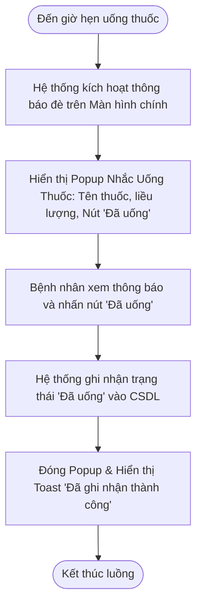

# BÁO CÁO THIẾT KẾ TÍNH NĂNG NHẮC UỐNG THUỐC RIKKEICARE

> 👤 **Học viên:** Đỗ Hoàng Sơn | **Mã SV:** PTIT-HCM-066
> 🏫 **Môn học:** IT105-K25-Phan-tich-thi-t-k-h-th-ng

---

## 📊 Sơ đồ thiết kế hệ thống (Activity Diagram)

> 💡 *Sơ đồ dưới đây được render tự động trực tiếp trên GitHub bằng Mermaid. Bạn cũng có thể tải file **`bt2.drawio`** trong repository này để mở và chỉnh sửa trực tiếp trên [Draw.io (diagrams.net)](https://app.diagrams.net).* 

---

## Nhiệm vụ 1: Phân tích Use Case và Xác định Yếu tố UI (Bước 1)

Dựa trên kịch bản Use Case do BA bàn giao, nhóm người dùng mục tiêu của tính năng này là bệnh nhân mãn tính, phần lớn là người cao tuổi với thị lực suy giảm và phản xạ thao tác chậm. Do đó, việc xác định các yếu tố UI phải đảm bảo tính rõ ràng (Clarity) và tính tối giản (Simplicity).

Xác định Actor chính và thành phần UI tương ứng cho từng chức năng trong luồng tương tác:

- Actor chính: Bệnh nhân (người lớn tuổi sử dụng ứng dụng RikkeiCare) và Hệ thống RikkeiCare (tác nhân ngầm kích hoạt thông báo theo mốc thời gian đã cài đặt).
- (a) Khối hiển thị tên thuốc: Sử dụng UI Component là Popup Dialog / Modal Card đặt chính giữa màn hình với nền mờ overlay bên dưới để thu hút sự chú ý. Tên thuốc được hiển thị bằng Typography chuẩn accessibility (chữ in đậm, kích thước tối thiểu 22sp-24sp, độ tương phản tương thích WCAG AAA) kèm biểu tượng viên thuốc trực quan.
- (b) Nút phản hồi 'Đã uống': Sử dụng UI Component là Primary Button (CTA Button) có kích thước lớn (chiều cao tối thiểu 56dp, tràn chiều ngang Popup), màu nền nổi bật (xanh lục đại diện cho hoàn thành/an toàn), chữ in hoa 'ĐÃ UỐNG' cỡ 20sp để người già bấm dễ dàng không bị nhầm lẫn.

| Thành phần nghiệp vụ | Actor thực hiện | Thành phần UI đề xuất | Đặc tính thiết kế (Clarity & Usability) |
| --- | --- | --- | --- |
| Tự động kích hoạt nhắc nhở | Hệ thống RikkeiCare | Modal Overlay + Audio Alert | Làm mờ nền 50%, phát âm thanh nhẹ nhàng để gây chú ý |
| Hiển thị thông tin tên thuốc & liều lượng | Bệnh nhân xem | Card Content Block (Typography 24sp) | Chữ đen/xanh đậm trên nền trắng, bổ sung icon viên thuốc sinh động |
| Phản hồi hoàn tất uống thuốc | Bệnh nhân bấm | Full-width Primary Button | Nút xanh lục #2E7D32, chiều cao 56dp, padding rộng, dễ bấm bằng ngón tay trỏ/cái |

## Nhiệm vụ 2: Thiết kế Bố cục Wireframe theo Luồng (Bước 2)

Luồng giao diện được thiết kế nối tiếp 2 khung Wireframe vào vùng không gian trống trên màn hình chính hiện trạng của ứng dụng RikkeiCare:

Khung Wireframe 1 — Thông báo nhắc thuốc vừa hiện lên: Nền màn hình chính RikkeiCare hiện tại bị phủ lớp màu tối mờ (dim background). Giữa màn hình xuất hiện một hộp thông báo nổi (Dialog Popup) góc bo 16px. Phần trên cùng có icon biểu tượng đồng hồ báo thức kèm tiêu đề 'ĐẾN GIỜ UỐNG THUỐC'. Nhãn thông tin chính giữa hiển thị tên thuốc 'Amlodipine 5mg' cỡ chữ 24sp in đậm, bên dưới là dòng chú thích liều lượng '1 viên - Uống sau bữa ăn sáng'. Phía dưới cùng của Popup là duy nhất 01 nút bấm màu xanh lục với nhãn chữ 'ĐÃ UỐNG' cỡ lớn.

Khung Wireframe 2 — Màn hình sau khi bấm 'Đã uống': Ngay sau khi bệnh nhân chạm vào nút 'Đã uống', hộp thông báo Popup lập tức đóng lại, trả lại giao diện màn hình chính RikkeiCare. Ở phía trên cùng màn hình xuất hiện một thanh thông báo Toast màu xanh dương nhạt trong 3 giây với nội dung: 'Đã ghi nhận: Bạn đã uống Amlodipine 5mg lúc 08:00' kèm tích xanh. Khối 'Lịch trình hôm nay' trên màn hình chính cập nhật trạng thái liều thuốc này thành 'Đã hoàn thành'.

## Nhiệm vụ 3: Tinh chỉnh UI theo Nguyên tắc Usability và Định luật Hick (Bước 3)

Theo Định luật Hick (Hick's Law), thời gian cần thiết để một người đưa ra quyết định tăng theo tỷ lệ thuận với số lượng và độ phức tạp của các lựa chọn được cung cấp.

Nếu thiết kế thêm 4-5 nút lựa chọn phản hồi (như 'Đã uống', 'Bỏ qua', 'Nhắc lại sau 15 phút', 'Chưa mua kịp thuốc', 'Báo bác sĩ') thay vì chỉ 1 nút 'Đã uống', bệnh nhân lớn tuổi sẽ rơi vào trạng thái quá tải nhận thức (cognitive overload), dễ bối rối khi mắt mờ không đọc hết các lựa chọn, dẫn đến bấm nhầm nút hoặc tắt ứng dụng mà không hoàn thành việc ghi nhận uống thuốc.

---

## 📁 Danh sách tệp tin nộp bài trong Repository
- 📝 `bt2.docx`: Báo cáo tài liệu phân tích nghiệp vụ hoàn chỉnh.
- 🎨 `bt2.drawio`: File thiết kế sơ đồ chuẩn theo quy định đề bài (mở trực tiếp bằng [Draw.io](https://app.diagrams.net) hoặc Lucidchart).
