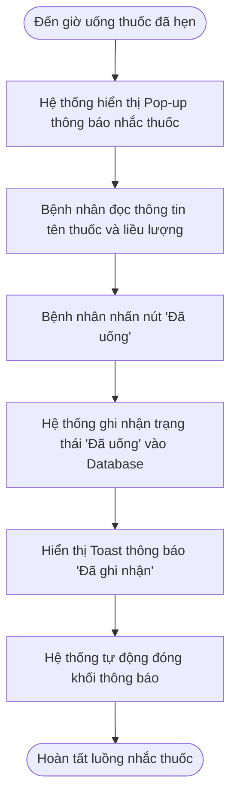

# BÁO CÁO THIẾT KẾ TÍNH NĂNG NHẮC UỐNG THUỐC RIKKEICARE CHO BỆNH NHÂN LỚN TUỔI

> 👤 **Học viên:** Đỗ Hoàng Sơn | **Mã SV:** PTIT-HCM-066
> 🏫 **Môn học:** IT105-K25-Phan-tich-thi-t-k-h-th-ng

---

## 📊 Sơ đồ thiết kế hệ thống (Activity Diagram)

> 💡 *Sơ đồ dưới đây được render tự động trực tiếp trên GitHub bằng Mermaid. Bạn cũng có thể tải file **`bt2.drawio`** trong repository này để mở và chỉnh sửa trực tiếp trên [Draw.io (diagrams.net)](https://app.diagrams.net).* 

---

## Nhiệm vụ 1: Phân tích Use Case & Xác định yếu tố UI (Bước 1)

Đối tượng người dùng mục tiêu của tính năng này là bệnh nhân mãn tính, phần lớn là người lớn tuổi có thị lực suy giảm, phản xạ chậm và dễ bối rối trước các giao diện phức tạp. Do đó, các thành phần UI phải được tối ưu chuẩn Clarity (rõ ràng) và Accessibility.

Dựa trên kịch bản Use Case do BA bàn giao, việc phân tích Actor và quy hoạch các thành phần giao diện (UI Elements) được thực hiện cụ thể như sau:

- Actor chính: Bệnh nhân (đặc biệt là bệnh nhân lớn tuổi đang điều trị bệnh mãn tính).
- Thành phần UI (a) - Khối hiển thị tên thuốc: Sử dụng dạng thẻ Pop-up Modal hoặc Card nổi bật ở nửa trên màn hình chính. Cỡ chữ tên thuốc tối thiểu 18-20pt, phông chữ Sans-serif chân phương, màu tương phản cao (chữ đen/xanh đậm trên nền trắng) kèm biểu tượng viên thuốc trực quan.
- Thành phần UI (b) - Nút phản hồi 'Đã uống': Sử dụng thiết kế dạng Primary Button với chiều cao tối thiểu 52px (đạt chuẩn touch target), màu xanh lá cây hoặc xanh dương tạo cảm giác an tâm, chữ viết hoa đậm 'ĐÃ UỐNG' căn giữa.

| Thành phần | Thực thể UI | Thông số thiết kế & Trải nghiệm (UX/UI) | Mục tiêu đáp ứng |
| --- | --- | --- | --- |
| Actor | Bệnh nhân lớn tuổi | Người dùng mắt kém, thao tác tay hay run, sợ ấn nhầm | Tối ưu trải nghiệm Accessibility |
| Khối hiển thị tên thuốc | Card Notification / Pop-up Banner | Font size >= 18pt, Bold, có Icon minh họa, hiển thị tên thuốc + liều dùng (ví dụ: 'Amlodipin 5mg - 1 viên') | Đảm bảo nguyên tắc Clarity (To, rõ, đọc được ngay không cần kính) |
| Nút phản hồi | Button Primary (CTA) | Kích thước lớn (min 52px height), viền bo góc nhẹ, màu sắc nổi bật, nhãn chữ 'ĐÃ UỐNG' | Đảm bảo nguyên tắc Simplicity (1 hành động duy nhất, dễ ấn) |

## Nhiệm vụ 2: Vẽ Wireframe theo luồng tương tác (Bước 2)

Luồng thiết kế màn hình được thể hiện qua 2 trạng thái Wireframe nối tiếp nhau, đính kèm khối thông báo nhắc thuốc vào vùng trung tâm màn hình chính của ứng dụng RikkeiCare.

- Khung Wireframe 1 (Thông báo xuất hiện): Màn hình chính mờ nhẹ (overlay background), khối thông báo nhắc uống thuốc hiện lên nổi bật ở giữa. Nội dung hiển thị: '[BIỂU TƯỢNG VIÊN THUỐC] ĐẾN GIỜ UỐNG THUỐC! - Tên thuốc: Amlodipin 5mg (1 viên)'. Ngay bên dưới là nút 'ĐÃ UỐNG' màu xanh, kích thước lớn tràn ngang khối thông báo.
- Khung Wireframe 2 (Sau khi nhấn 'Đã uống'): Khối thông báo nhắc thuốc đóng lại, hệ thống hiển thị thanh Toast xác nhận ngắn gọn ở góc dưới màn hình trong 2 giây: 'Đã ghi nhận bạn uống thuốc lúc 08:00'. Màn hình chính RikkeiCare trở lại trạng thái bình thường.

| Trạng thái Wireframe | Mô tả chi tiết giao diện | Hành động của người dùng |
| --- | --- | --- |
| Khung 1: Pop-up nhắc uống thuốc | Màn hình chính bị mờ đi. Ở giữa xuất hiện bảng thông báo màu trắng, viền xám nhẹ: Tiêu đề 'NHẮC UỐNG THUỐC', chữ to 'Amlodipin 5mg - 1 viên'. Nút bấm to màu xanh chữ trắng: [ ĐÃ UỐNG ] | Bệnh nhân xem thông báo và chạm vào nút [ ĐÃ UỐNG ] |
| Khung 2: Đóng thông báo & Xác nhận | Pop-up biến mất. Màn hình chính trở lại bình thường. Xuất hiện một ô thông báo nhỏ màu xanh lá ở phía dưới: '✓ Đã ghi nhận lịch uống thuốc thành công!' | Bệnh nhân hoàn thành công việc và tiếp tục dùng ứng dụng |

## Nhiệm vụ 3: Tinh chỉnh theo nguyên tắc UI và Định luật Hick (Bước 3)

Định luật Hick (Hick's Law) chỉ ra rằng: Thời gian đưa ra quyết định của một người sẽ tăng lên theo tỷ lệ thuận với số lượng lựa chọn hiển thị trước mắt họ (T = b * log2(n + 1)).

Nếu thiết kế giao diện bằng cách thêm 4-5 nút lựa chọn phản hồi (ví dụ: 'Đã uống', 'Chưa uống', 'Nhắc lại sau 15 phút', 'Bỏ qua lần này', 'Đã uống một nửa') thay vì chỉ có 1 nút 'Đã uống', điều này sẽ gây ra tình trạng quá tải nhận thức (cognitive overload) nghiêm trọng cho bệnh nhân lớn tuổi. Họ sẽ cảm thấy bối rối, mất nhiều thời gian đọc từng tùy chọn, lo sợ bấm sai dẫn đến việc trì hoãn hoặc bỏ qua không phản hồi thông báo.

Do đó, việc tối giản giao diện với chỉ 1 lựa chọn duy nhất 'Đã uống' giúp loại bỏ hoàn toàn do dự, giúp người lớn tuổi phản hồi chính xác trong chưa đầy 1 giây, đáp ứng hoàn hảo nguyên tắc Simplicity trong thiết kế UI/UX.

## Đánh giá sơ đồ thiết kế và Hướng dẫn mở trên Draw.io

Sơ đồ Activity Diagram thể hiện trọn vẹn luồng tương tác và chuyển đổi trạng thái hệ thống đã được biên soạn theo chuẩn UML 2.0. Mã Mermaid trực quan cũng được tích hợp giúp xem nhanh trong các môi trường hỗ trợ.

File thiết kế sơ đồ dạng chuẩn '.drawio' đã được kết xuất và sẵn sàng để tải lên Draw.io (diagrams.net) phục vụ công tác chỉnh sửa hoặc trình bày chuyên sâu.

---

## 📁 Danh sách tệp tin nộp bài trong Repository
- 📝 `bt2.docx`: Báo cáo tài liệu phân tích nghiệp vụ hoàn chỉnh.
- 🎨 `bt2.drawio`: File thiết kế sơ đồ chuẩn theo quy định đề bài (mở trực tiếp bằng [Draw.io](https://app.diagrams.net) hoặc Lucidchart).
