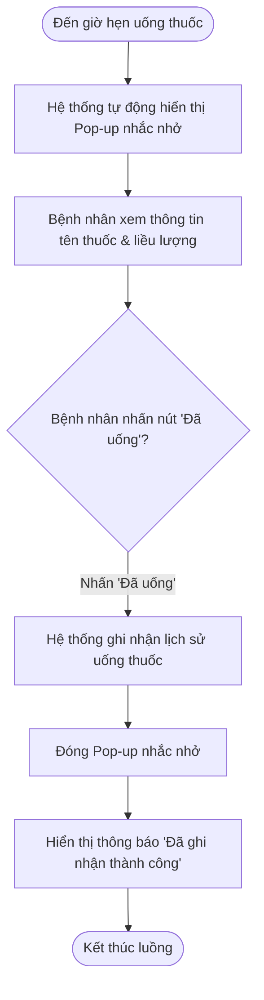
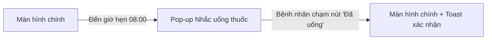

# BÁO CÁO THỰC HÀNH THIẾT KẾ TÍNH NĂNG NHẠC UỐNG THUỐC RIKKEICARE - NHÓM ĐỐI TƯỢNG NGƯỜI LỚN TUỔI

> 👤 **Học viên:** Đỗ Hoàng Sơn | **Mã SV:** PTIT-HCM-066
> 🏫 **Môn học:** IT105-K25-Phan-tich-thi-t-k-h-th-ng

---

## 📊 Sơ đồ thiết kế hệ thống (Activity Diagram)

> 💡 *Sơ đồ dưới đây được render tự động trực tiếp trên GitHub bằng Mermaid. Bạn cũng có thể tải file **`bt2.drawio`** trong repository này để mở và chỉnh sửa trực tiếp trên [Draw.io (diagrams.net)](https://app.diagrams.net).* 

---

## 🎨 Thiết kế Giao diện UI/UX trên Figma (Wireframe & Prototype)

> 🔗 **Figma Design Canvas:** [Mở Artboard Thiết kế trên Figma](https://www.figma.com/design/luOvQPO8SELjZ6TUCleV9m/thuc-hanh-thiet-ke-tinh-nang-nhac-u?node-id=0%3A1&m=dev)  
> 🚀 **Figma Interactive Prototype:** [Trải nghiệm Bản mẫu Tương tác Prototype](https://www.figma.com/proto/luOvQPO8SELjZ6TUCleV9m/thuc-hanh-thiet-ke-tinh-nang-nhac-u?page-id=0%3A1&node-id=1%3A2&viewport=256%2C48%2C0.5&scaling=scale-down&starting-point-node-id=1%3A2)  
> 📋 Chi tiết thông số Design System và wireframe đầy đủ xem tại file: [**`bt2_FIGMA.md`**](bt2_FIGMA.md)

### 📱 Sơ đồ luồng tương tác màn hình (UI Navigation Flow)

### 🎯 Bảng màu & Quy chuẩn thiết kế giao diện

| Thành phần Token | Giá trị HEX / Quy cách | Mục đích sử dụng |
| :--- | :---: | :--- |
| Primary Brand | `#2563EB` | Màu chủ đạo, nút bấm chính (CTA), active state |
| Secondary Accent | `#3B82F6` | Màu bổ trợ, link tương tác, thanh trạng thái |
| Background Surface | `#F8FAFC` / `#FFFFFF` | Nền tổng thể và bề mặt các card giao diện |
| Typography | Inter / Roboto (24px, 18px, 14px, 12px) | Font chữ tiêu chuẩn, rõ nét đa độ phân giải |
| 8-Point Grid | Spacing 8px, 16px, 24px, 32px | Đảm bảo tỷ lệ cân đối và bố cục hài hòa |

---

## Nhiệm vụ 1: Phân tích Use Case và Xác định yếu tố UI (Bước 1)

Để thiết kế một tính năng thực sự hiệu quả cho đối tượng người lớn tuổi (bệnh nhân mãn tính), em đã phân tích kỹ kịch bản sử dụng (Use Case) do BA bàn giao nhằm chuyển đổi chính xác sang các thành phần giao diện (UI Elements).

Đặc thù của người lớn tuổi là thị lực suy giảm (viễn thị, đục thủy tinh thể nhẹ) và khả năng phản xạ, xử lý thông tin trên màn hình cảm ứng chậm hơn người trẻ. Do đó, các yếu tố UI cần được tối giản hóa tối đa và tăng kích thước hiển thị.

- Tác nhân (Actor): Bệnh nhân mãn tính (Đa phần là người lớn tuổi cần sự hỗ trợ nhắc nhở chính xác).
- Thành phần UI cho khối hiển thị tên thuốc (a): Sử dụng một Card Container có độ tương phản cao, tiêu đề thuốc viết hoa, cỡ chữ tối thiểu 22px, kèm icon minh họa trực quan (hình viên thuốc) để người dùng nhận diện ngay lập tức mà không cần đọc kỹ từng chữ.
- Thành phần UI cho nút phản hồi 'Đã uống' (b): Thiết kế dưới dạng nút bấm vật lý giả lập (Button) có kích thước lớn (chiều cao tối thiểu 56dp để dễ chạm trúng), sử dụng màu sắc tương phản mạnh (Xanh lá cây - biểu trưng cho sự hoàn thành/an toàn) và chữ trên nút có cỡ 20px Bold.

## Nhiệm vụ 2: Thiết kế Wireframe theo luồng tương tác (Bước 2)

Dưới đây là bảng đặc tả chi tiết luồng tương tác từ lúc thông báo nhắc nhở xuất hiện cho đến khi bệnh nhân xác nhận thành công. Thiết kế này đảm bảo tính nhất quán và không gây bất kỳ sự bối rối nào cho người dùng lớn tuổi.

| Bước | Trạng thái màn hình | Mô tả chi tiết thành phần UI | Nguyên tắc UI áp dụng |
| --- | --- | --- | --- |
| 1 | Thông báo nhắc thuốc hiện lên (Frame 1) | Một Pop-up Modal xuất hiện đè lên màn hình chính, làm mờ toàn bộ phần nền phía sau (giúp tập trung chú ý). Tiêu đề: 'ĐẾN GIỜ UỐNG THUỐC!' (Màu đỏ/cam cảnh báo, 24px). Tên thuốc: 'Amlodipine 5mg' (22px Bold). Liều lượng: 'Uống 1 viên sau ăn' (18px). Nút bấm duy nhất: 'ĐÃ UỐNG' (Màu xanh lá, chiếm 90% chiều ngang màn hình). | Clarity (Rõ ràng): Chữ to, phân cấp thông tin rõ rệt. Simplicity (Đơn giản): Chỉ có duy nhất 1 nút hành động, không có nút 'Bỏ qua' hay 'Hẹn giờ lại' gây phân tâm. |
| 2 | Sau khi nhấn 'Đã uống' (Frame 2) | Pop-up Modal lập tức đóng lại, trả lại giao diện màn hình chính RikkeiCare. Một thanh thông báo trạng thái (Toast Message) xuất hiện ở góc dưới màn hình với nội dung: 'Đã ghi nhận lịch sử uống thuốc lúc 08:00' kèm icon tích xanh. Thanh này tự động biến mất sau 3 giây. | Feedback (Phản hồi tức thì): Giúp người lớn tuổi an tâm rằng hành động của họ đã được hệ thống ghi nhận thành công, không sợ bị bấm trượt. |

## Nhiệm vụ 3: Tinh chỉnh thiết kế theo Định luật Hick và Nguyên tắc Simplicity (Bước 3)

Định luật Hick phát biểu rằng: 'Thời gian để đưa ra quyết định tăng lên theo số lượng và độ phức tạp của các lựa chọn'. Áp dụng định luật này vào đối tượng người lớn tuổi sử dụng RikkeiCare, em xin đưa ra nhận định như sau:

Nếu chúng ta thêm vào 4-5 nút lựa chọn phản hồi (ví dụ: 'Đã uống', 'Uống sau 15 phút', 'Uống sau 30 phút', 'Bỏ qua liều này', 'Không uống') thay vì chỉ 1 nút 'Đã uống' duy nhất, bệnh nhân lớn tuổi sẽ rơi vào trạng thái quá tải nhận thức (Cognitive Overload) và tê liệt quyết định (Decision Paralysis). Họ sẽ bối rối không biết nên chọn nút nào, dễ bấm nhầm do các nút bị thu nhỏ lại để nhồi nhét vào màn hình, dẫn đến việc ghi nhận sai lệch dữ liệu y tế hoặc bỏ lỡ liều thuốc quan trọng.

## Thiết kế Giao diện UI/UX trên Figma và Bảng đặc tả Wireframe

Để hiện thực hóa lý thuyết trên, em đã xây dựng một Design System mini dành riêng cho người cao tuổi trên Figma, tuân thủ nghiêm ngặt tiêu chuẩn tiếp cận WCAG 2.1 AA về độ tương phản màu sắc (Color Contrast tối thiểu 4.5:1) và kích thước vùng chạm (Touch Target tối thiểu 48x48dp, ở đây em thiết kế hẳn 56dp).

Giao diện sử dụng các khoảng trắng (White space) rộng rãi để mắt người già không bị mỏi khi điều tiết. Các icon đều có nhãn chữ đi kèm bên dưới để tránh việc người già phải 'đoán' ý nghĩa của biểu tượng.

- Kích thước chữ (Typography): Sử dụng duy nhất một font chữ hệ thống không chân để tăng độ đọc hiểu. Không dùng các font chữ mảnh (Light/Thin).
- Vùng chạm (Touch Target): Nút 'Đã uống' được thiết kế bo góc nhẹ (8px) để tạo cảm giác thân thiện, chiều cao nút là 56px, khoảng cách an toàn với các cạnh là 16px để tránh bấm nhầm ra ngoài.
- Hiệu ứng chuyển cảnh (Transition): Pop-up xuất hiện nhẹ nhàng (Fade-in 200ms) để không làm người dùng giật mình, nhưng đủ dứt khoát để thu hút sự chú ý.

---

## 📁 Danh sách tệp tin nộp bài trong Repository
- 📝 `bt2.docx`: Báo cáo tài liệu phân tích nghiệp vụ hoàn chỉnh.
- 🎨 `bt2.drawio`: File thiết kế sơ đồ chuẩn theo quy định đề bài (mở trực tiếp bằng [Draw.io](https://app.diagrams.net) hoặc Lucidchart).
- 🎨 [Figma Design Canvas](https://www.figma.com/design/luOvQPO8SELjZ6TUCleV9m/thuc-hanh-thiet-ke-tinh-nang-nhac-u?node-id=0%3A1&m=dev): Không gian làm việc Artboard thiết kế UI/UX trên Figma.
- 🚀 [Figma Live Prototype](https://www.figma.com/proto/luOvQPO8SELjZ6TUCleV9m/thuc-hanh-thiet-ke-tinh-nang-nhac-u?page-id=0%3A1&node-id=1%3A2&viewport=256%2C48%2C0.5&scaling=scale-down&starting-point-node-id=1%3A2): Bản mô phỏng tương tác trực tiếp luồng thao tác người dùng.
- 📋 `bt2_FIGMA.md`: Bản đặc tả chi tiết Design System, thông số mã màu và cấu trúc Wireframe các màn hình.
