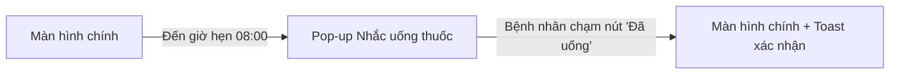

# 🎨 BẢN ĐẶC TẢ THIẾT KẾ GIAO DIỆN UI/UX TRÊN FIGMA

> 👤 **Học viên:** Đỗ Hoàng Sơn | **Mã SV:** PTIT-HCM-066
> 🏫 **Môn học:** IT105-K25-Phan-tich-thi-t-k-h-th-ng
> 📌 **Bài tập:** Bài 2 - Session 14
> 🏷️ **Dự án thiết kế:** RikkeiCare - Thiet Ke Tinh Nang Nhac Uong Thuoc Cho Nguoi Cao Tuoi

---

## 🔗 LIÊN KẾT TRỰC TIẾP DỰ ÁN FIGMA

[](https://www.figma.com/design/luOvQPO8SELjZ6TUCleV9m/thuc-hanh-thiet-ke-tinh-nang-nhac-u?node-id=0%3A1&m=dev)
[](https://www.figma.com/proto/luOvQPO8SELjZ6TUCleV9m/thuc-hanh-thiet-ke-tinh-nang-nhac-u?page-id=0%3A1&node-id=1%3A2&viewport=256%2C48%2C0.5&scaling=scale-down&starting-point-node-id=1%3A2)

- 🎨 **Figma Design Canvas (Artboards, Styles & Design Tokens):**  
  👉 [https://www.figma.com/design/luOvQPO8SELjZ6TUCleV9m/thuc-hanh-thiet-ke-tinh-nang-nhac-u?node-id=0%3A1&m=dev](https://www.figma.com/design/luOvQPO8SELjZ6TUCleV9m/thuc-hanh-thiet-ke-tinh-nang-nhac-u?node-id=0%3A1&m=dev)
- 🚀 **Figma Interactive Prototype (Trải nghiệm tương tác luồng người dùng):**  
  👉 [https://www.figma.com/proto/luOvQPO8SELjZ6TUCleV9m/thuc-hanh-thiet-ke-tinh-nang-nhac-u?page-id=0%3A1&node-id=1%3A2&viewport=256%2C48%2C0.5&scaling=scale-down&starting-point-node-id=1%3A2](https://www.figma.com/proto/luOvQPO8SELjZ6TUCleV9m/thuc-hanh-thiet-ke-tinh-nang-nhac-u?page-id=0%3A1&node-id=1%3A2&viewport=256%2C48%2C0.5&scaling=scale-down&starting-point-node-id=1%3A2)

---

## 🎯 1. HỆ THỐNG THIẾT KẾ (DESIGN SYSTEM & TOKENS)

### 🎨 Bảng mã màu chuẩn (Color Palette)

| Tên Token | Mã HEX | Vai trò & Ứng dụng |
| :--- | :---: | :--- |
| Primary Brand (Y tế) | `#0284C7` | Màu xanh dương chủ đạo, tạo cảm giác an tâm, tin cậy |
| Success Accent | `#16A34A` | Màu xanh lá cho nút 'Đã uống' và thông báo thành công |
| Background Canvas | `#F8FAFC` | Nền màn hình chính của ứng dụng |
| Surface Card (Pop-up) | `#FFFFFF` | Nền của Pop-up nhắc nhở để nổi bật trên màn hình tối |
| Text Primary | `#1E293B` | Màu chữ tiêu đề và tên thuốc, độ tương phản cực cao |

### ✍️ Quy chuẩn Typography & Font chữ

- **Font Family:** `Inter`, `Roboto`, `system-ui` (Độ rõ nét cao trên mọi màn hình).
- **H1 (Header chính màn hình):** 24px - Bold (700) - Line height 32px.
- **H2 (Tiêu đề phân đoạn / Block header):** 18px - SemiBold (600) - Line height 24px.
- **Body Text (Nội dung văn bản):** 14px - Regular (400) - Line height 20px.
- **Caption & Footnote:** 12px - Medium (500) - Line height 16px.

### 📐 Hệ thống Lưới & Khoảng cách (Grid & Spacing)

- **Quy tắc 8-Point Grid:** Toàn bộ khoảng cách lề (margin), khoảng cách đệm (padding) tuân thủ bội số của 8 (8px, 16px, 24px, 32px, 48px).
- **Bố cục Layout Grid:** Mobile 4 cột (Margin 16px, Gutter 16px) hoặc Web Responsive 12 cột (Max-width 1200px, Gutter 24px).

---

## 📱 2. SƠ ĐỒ LUỒNG ĐIỀU HƯỚNG GIAO DIỆN (UI FLOW)



---

## 📐 3. ĐẶC TẢ CHI TIẾT CÁC MÀN HÌNH WIREFRAME

### 📱 Màn hình 1: Trang chủ RikkeiCare (Trạng thái bình thường)

> 💡 **Mục đích:** Hiển thị giao diện trang chủ khi chưa đến giờ hẹn uống thuốc.

**Các thành phần UI chính:**
- 🔹 Header chào mừng bệnh nhân
- 🔹 Lịch hẹn khám
- 🔹 Chỉ số sức khỏe
- 🔹 Bottom Navigation Bar

**Bố cục Wireframe & Phân vùng màn hình:**
```text
Header -> Health Stats Card -> Appointment Card -> Bottom Nav
```

### 📱 Màn hình 2: Pop-up Nhắc uống thuốc xuất hiện

> 💡 **Mục đích:** Tự động hiển thị đè lên màn hình chính khi đến giờ hẹn, thu hút sự chú ý tối đa.

**Các thành phần UI chính:**
- 🔹 Lớp phủ mờ nền (Overlay)
- 🔹 Hộp thoại Pop-up màu trắng nổi bật
- 🔹 Biểu tượng hộp thuốc lớn
- 🔹 Tên thuốc & Liều lượng (Chữ rất to)
- 🔹 Nút 'Đã uống' màu xanh lá cây chiếm toàn bộ chiều ngang

**Bố cục Wireframe & Phân vùng màn hình:**
```text
Dark Overlay -> Pop-up Container -> Icon -> Medicine Name & Dosage -> Large 'Đã uống' Button
```

### 📱 Màn hình 3: Xác nhận ghi nhận thành công

> 💡 **Mục đích:** Đóng Pop-up và hiển thị thông báo Toast xác nhận hệ thống đã lưu lịch sử.

**Các thành phần UI chính:**
- 🔹 Màn hình chính trở lại trạng thái bình thường
- 🔹 Toast Message màu xanh lá ở cạnh dưới: 'Hệ thống đã ghi nhận bạn đã uống thuốc lúc 08:00'

**Bố cục Wireframe & Phân vùng màn hình:**
```text
Main Screen -> Bottom Toast Message (Auto-dismiss in 3s)
```

---

## 🛠️ 4. HƯỚNG DẪN XEM VÀ KIỂM TRA TRÊN FIGMA

1. **Chế độ xem Thiết kế (Design Canvas):** Nhấp vào link [Figma Design Canvas](https://www.figma.com/design/luOvQPO8SELjZ6TUCleV9m/thuc-hanh-thiet-ke-tinh-nang-nhac-u?node-id=0%3A1&m=dev) để xem toàn bộ hệ thống Artboard, phân lớp Layer, Auto-layout và các Components.
2. **Chế độ chạy thử nghiệm (Interactive Prototype):** Nhấp vào link [Figma Live Prototype](https://www.figma.com/proto/luOvQPO8SELjZ6TUCleV9m/thuc-hanh-thiet-ke-tinh-nang-nhac-u?page-id=0%3A1&node-id=1%3A2&viewport=256%2C48%2C0.5&scaling=scale-down&starting-point-node-id=1%3A2) để trực tiếp click thử nghiệm các tương tác chuyển trang, hiệu ứng Smart Animate và luồng thao tác người dùng.
